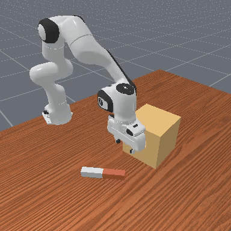
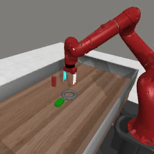
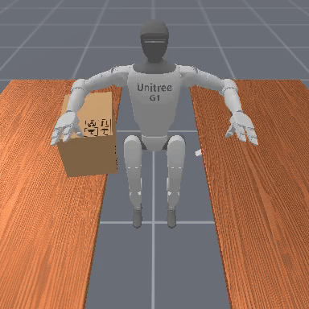
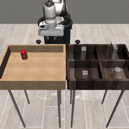

<h1>DEMO<sup>3</sup></span></h1>

Official implementation of

[DEMO<sup>3</sup>: Demonstration-Augmented Reward, Policy, and World Model Learning](https://adrialopezescoriza.github.io/demo3/) by

[Adrià López Escoriza](https://adrialopezescoriza.github.io), [Nicklas Hansen](https://nicklashansen.github.io), [Stone Tao](https://www.stoneztao.com/), [Tongzhou Mu](https://cseweb.ucsd.edu/~t3mu/), [Hao Su](https://cseweb.ucsd.edu/~haosu) (UC San Diego)</br>

</br>

[[Website]](https://adrialopezescoriza.github.io/demo3/) [[Paper]](https://arxiv.org/abs/2310.16828)

----

## Overview

**DEMO<sup>3</sup>** is a a framework that incorporates multi-stage dense reward learning, a bi-phasic training scheme, and world model learning into a carefully designed demonstration-augmented RL algorithm. Our evaluations demonstrate that our method improves data-efficiency by an average of **40%** and by **70%** on particularly difficult tasks compared to state-of-the-art approaches. We validate this across 16 sparse-reward tasks spanning four domains, including challenging humanoid visual control tasks using as few as five demonstrations.. 

<!-- <br/> -->

This repository contains code for training and evaluating **DEMO<sup>3</sup>**, MoDem and TD-MPC2 agents. We additionally open-source **20+** multi-stage tasks across 4 task domains: [Meta-World](https://meta-world.github.io/), [ManiSkill3](https://maniskill.readthedocs.io/en/latest/#) and [RoboSuite](https://robosuite.ai/). Our codebase supports both state and pixel observations. We hope that this repository will serve as a useful community resource for future research on demonstration-augmented RL.

----

## Getting started

You will need a machine with a GPU and at least 12 GB of RAM for state-based RL with DEMO<sup>3</sup>, and 32 GB of RAM for pixel-based observations. The GPU must be able to support CUDA 12.4 as a minimum.

We provide a `Dockerfile` for easy installation. You can build the docker image by running

```
cd docker && docker build . -t <user>/DEMO3:1.0.0
```

This docker image contains all dependencies needed for running ManiSkill3, Meta-World and Robosuite experiments.

If you prefer to install dependencies manually, start by installing dependencies via `conda` by running the following command:

```
conda env create -f docker/environment.yaml
```

The `environment.yaml` file installs dependencies required for training on ManiSkill and Meta-World tasks. Since Meta-Wolrd uses a is incompatible with the MuJoCo version of Robosuite we install a separate conda environment for this comains. The `robosuite.yaml` file installs dependencies required for training on Robosuite tasks.

----

## Supported tasks

This codebase currently supports **20+** continuous manipulation tasks from **ManiSkill3**, **Meta-World** and **Robosuite**. Specifically, we modify these manipulation tasks. See below table for expected name formatting for each task domain:

| domain | task | reward type
| --- | --- | --- |
| metaworld | mw-assembly-dense         | dense
| metaworld | mw-pick-place-wall-semi   | semi-sparse
| maniskill | ms-stack-cube-dense       | dense
| maniskill | ms-pick-place-semi        | semi-sparse
| robosuite | robosuite-lift-dense      | dense
| robosuite | robosuite-stack-semi      | semi-sparse


which can be run by specifying the `task` argument for `evaluation.py` or `train.py`. In order to change the observation type, use argument `obs=rgb` or `obs=state` in `demo3.yaml` or `eval.yaml`.


## Example usage

We provide examples on how to evaluate our provided DEMO<sup>3</sup> checkpoints, as well as how to train your own DEMO<sup>3</sup> agents, below.

### Evaluation

See below examples on how to evaluate pre-trained checkpoints. See `eval.yaml` for a complete list of arguments.

```
$ python evaluate.py task=ms-stack-cube-semi checkpoint=/path/to/stack-cube.pt save_video=true save_trajectories=true
$ python evaluate.py task=mw-assembly-dense checkpoint=/path/to/assembly.pt save_video=true save_trajectories=true
```

### Training

See below examples on how to train DEMO<sup>3</sup> on a multi-stage tasks. We recommend configuring [Weights and Biases](https://wandb.ai) (`wandb`) in `demo3.yaml` to track training progress.

```
$ python train.py task=ms-stack-cube-semi steps=1000000 demo_path=/path/to/ms-demos/stack-cube-200.pkl enable_reward_learning=true
$ python train.py task=mw-assembly-semi steps=500000 obs=rgb demo_path=/path/to/mw-demos/assembly-200.pkl enable_reward_learning=true
```

We recommend using default hyperparameters for single-task online RL from the official TDMPC2 implementation, although they can be modified in `tdmpc2.yaml`. Alternatively the backbone algorithm TDMPC2 can be ran by deactivating reward learning, demonstration oversampling and policy pretraining:

```
$ python train.py task=ms-stack-cube-semi steps=1000000 enable_reward_learning=false demo_sampling_ratio=0.0 policy_pretraining=False
```

----

## Acknowledgements
This codebase is built upon the [TD-MPC2](https://github.com/nicklashansen/tdmpc2) repository.

----

## Contributing

You are very welcome to contribute to this project. Feel free to open an issue or pull request if you have any suggestions or bug reports, but please review our [guidelines](CONTRIBUTING.md) first. Our goal is to build a codebase that can easily be extended to new environments and tasks, and we would love to hear about your experience!

----

## License

This project is licensed under the MIT License - see the `LICENSE` file for details. Note that the repository relies on third-party code, which is subject to their respective licenses.
